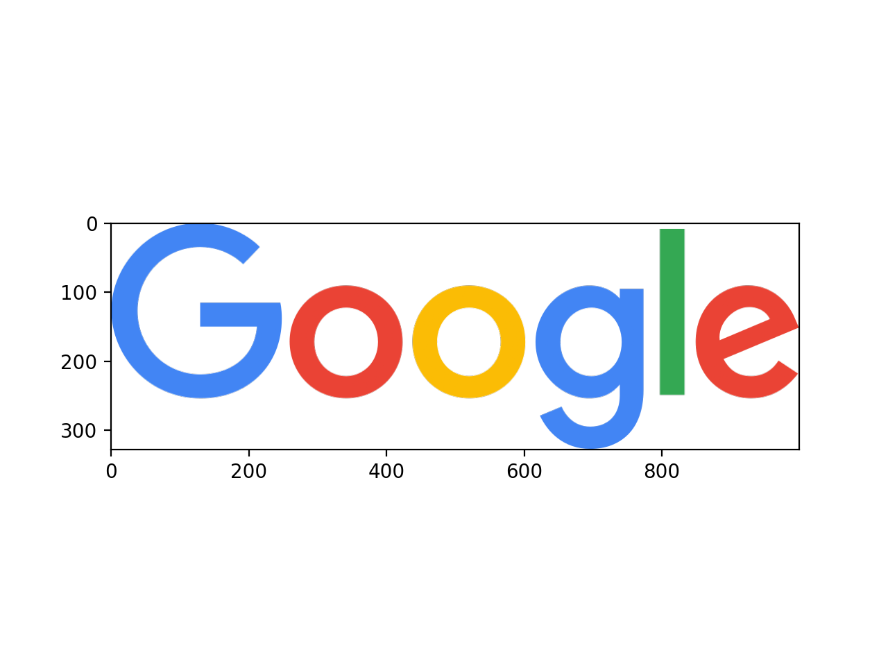
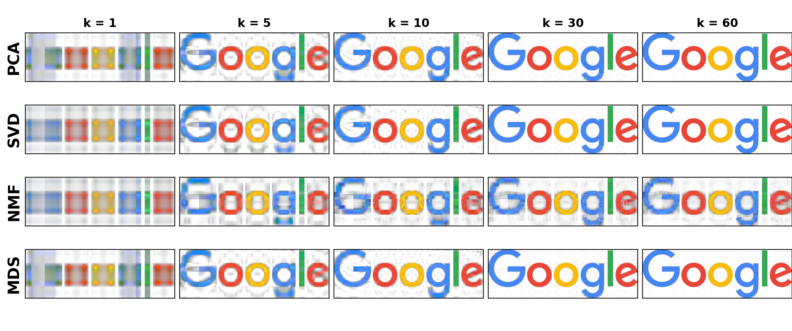

# low-rank-approximation
Dimensionality Reduction

## Principal Component Analysis (PCA)
Principal component analysis is by far the most popular dimensionality reduction technique. Given a set of data on n dimensions, this technique aims to find a linear lower-dimensional subspace (d-D) such that the data points lie mainly on this linear subspace. Such a reduced subspace attempts to maintain most of the variance of the data. The linear subspace can be specified by d orthogonal vectors that form a new coordinate system, called the principal components. The principal components are linear transformations of the original data points, so there can be no more than n of them. However, the hope is that only d << n principal components are needed to approximate the space spanned by the n original axes. Thus, for a given set of data vectors xi , i ∈ 1 . . . t, the d principal axes are those orthonormal axes onto which the variance retained under projection is maximal. This transformation is defined in such a way that the first principal component has the largest possible variance (that is, accounts for as much of the variability in the data as possible), and each succeeding component in turn has the highest variance possible under the constraint that it is orthogonal to (i.e., uncorrelated with) the preceding components.

## Singular Value Decomposition (SVD)
Singular Value Decomposition is a matrix decomposition method that leads to a low-dimensional representation of a high-dimensional matrix. Let A be a m × n matrix. Then the Singular Value Decom- position of matrix A is defined as: A = UΣVT, where:
* U : m × m matrix has as columns the eigenvectors of AAT
* Σ : m × n is a diagonal matrix with the singular values of A in the diagonal (= square roots of AAT eigenvalues)
* V : n × n matrix has as columns the eigenvectors of ATA

## Non-negative Matrix Factorization (NMF)
Given a non-negative n × m matrix V, find non-negative matrix factors W and H such that: V ≈ WH with W ∈ Rn×r and H ∈ Rr×m. To find this approximation we must define first a cost function that quantifies the quality of the approx- imation; the reconstruction error.

## Results

