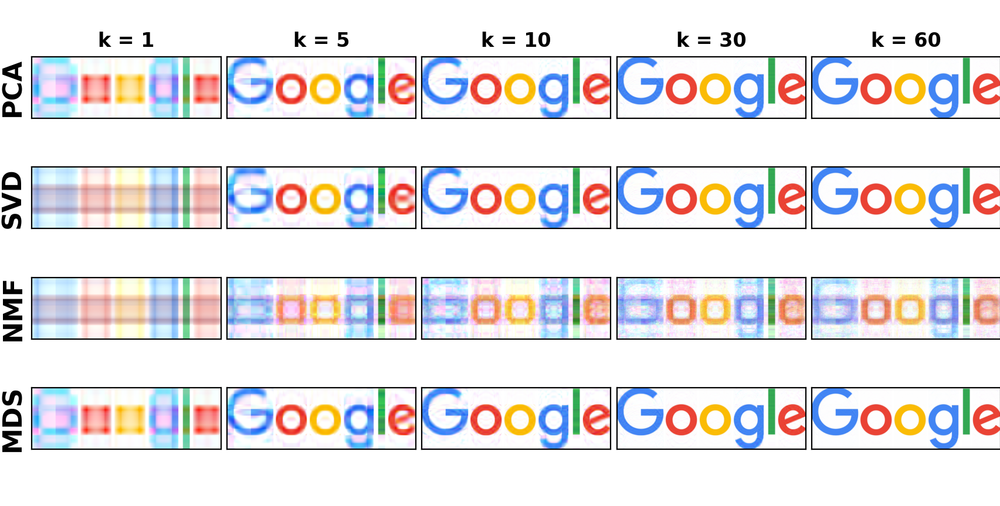

# Low Rank Approximation and Denoising of Images

## What is dimensionality reduction? 

Many Machine Learning problems involve a large number of features and it is often desirable to find a much lower-dimensional subspace of the high-dimensional space. This representation should preserve the more information on the data as possible. The main arguments for dimensionality reduction are: 
* Computation: too many features make training extremely slow, thus we want to compress the initial data to speed up operations
* Effectiveness: too many features can make it much harder to find a good solution, thus generating a smaller and more effective set of features is important
* Data visualization: reducing the number of dimensions down to 2 or 3 makes it possible to plot a condensed view of a high-dimensional set and gain insights by visually detecting patterns

Luckily, it is often possible to reduce the number of features considerably! For example, considering logo images: the pixels on the image borders are almost always white, so we could completely drop these pixels from the training set without losing much information. Moreover, two neighboring pixels are often highly correlated: merging them into a single pixel won't result in. too much not loss of information.

## The Curse of Dimensionality

This problem of ... is often referred to as the curse of dimensionality.

## Project

In image denoising, a compromise has to be found between noise reduction and preserving significant image details. Dimensionality reduction techniques for simplifying a dataset by reducing datasets to lower dimensions are commonly used for data reduction in statistical pattern recognition and signal processing. Here we propose an implementation of the PCA, MDS, SVD and NFM algorithms to obtain low rank approximations and denoise images.
we will be working with images, where each pixel is encoded by four values, namely RGBA (red, green, blue, alpha). These four dimensions encoding each pixel will be referred to as the four channels of our images. We will create low rank approximations separately for each channel, i.e. to obtain a low rank approxiamtion for the images, we will separately calculate the low rank approximation for each channel of the input image and then concatinate these low rank approximations.
 
 
#### Principal Component Analysis (PCA)
> Principal component analysis is by far the most popular dimensionality reduction technique. Given a set of data on n dimensions, this technique aims to find a linear lower-dimensional subspace (d-D) such that the data points lie mainly on this linear subspace. Such a reduced subspace attempts to maintain most of the variance of the data. The linear subspace can be specified by d orthogonal vectors that form a new coordinate system, called the principal components. The principal components are linear transformations of the original data points, so there can be no more than n of them. However, the hope is that only d << n principal components are needed to approximate the space spanned by the n original axes. Thus, for a given set of data vectors xi , i ∈ 1 . . . t, the d principal axes are those orthonormal axes onto which the variance retained under projection is maximal. This transformation is defined in such a way that the first principal component has the largest possible variance (that is, accounts for as much of the variability in the data as possible), and each succeeding component in turn has the highest variance possible under the constraint that it is orthogonal to (i.e., uncorrelated with) the preceding components.

#### Singular Value Decomposition (SVD)
> Singular Value Decomposition is a matrix decomposition method that leads to a low-dimensional representation of a high-dimensional matrix. Let A be a m × n matrix. Then the Singular Value Decom- position of matrix A is defined as: A = UΣVT, where:
* U : m × m matrix has as columns the eigenvectors of AAT
* Σ : m × n is a diagonal matrix with the singular values of A in the diagonal (= square roots of AAT eigenvalues)
* V : n × n matrix has as columns the eigenvectors of ATA

#### Non-negative Matrix Factorization (NMF)
> Given a non-negative n × m matrix V, find non-negative matrix factors W and H such that: V ≈ WH with W ∈ Rn×r and H ∈ Rr×m. To find this approximation we must define first a cost function that quantifies the quality of the approx- imation; the reconstruction error.

## Results
The image we will be working with iis the following one:

We create the PCA, SVD, NMF and MDS functions that calculate low rank approximations of the input image with 4 channels and apply them to produce low rank approximation images of the google logo for k equals 1, 5, 10, 30 and 60. Here are the results: 

